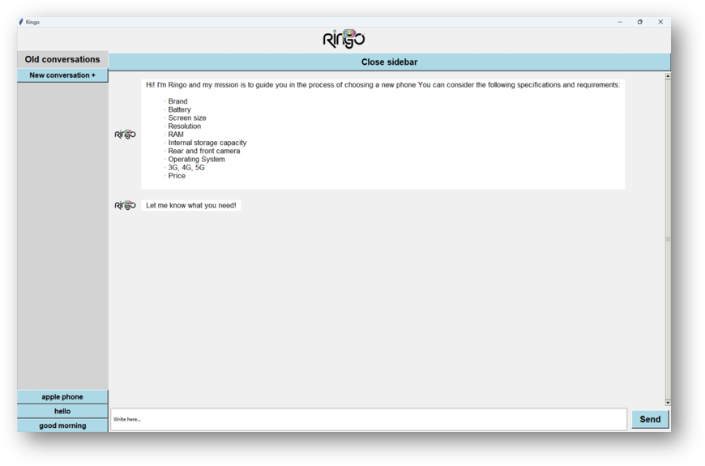

# RINGO - Chatbot

## Table of Contents
  - [Overview](#overview)
  - [Installation](#installation)
  - [Dependecies](#dependencies)
  - [Usage](#usage)
  - [Visualization](#visualization)
  - [Input Examples](#input-examples)
  - [Group members](#group-members)
  - [References](#references)

## Overview
This chatbot has been created with the idea of helping undecided people when choosing their new mobile phone. In an easy and very intuitive way, this chatbot will recommend the best options that adapt to what the user is looking for.

## Installation
Project can be downloaded from the attached folder or by clonning our GitHub repository:

```bash
git clone https://github.com/gpol2003/Chatbot_SBC.git
```

## Dependencies
### Phyton

You can download these libraries by typing this command in terminal:
```bash
pip install <library_name>
```
Project dependecies:
+ **thinker**: to create visual interface of the chatbot.
+ **pandas**: to read csv files and working with big ammount of data.
+ **nltk**: for natural language preprocessing.
  + **punkt**
  + **stopwords**
  + **wordnet**
  + **omw-1.4**
  + **averaged_perceptron_tagger** 
+ **requests**: for API operations 
+ **json**: for read/write the chat files
+ **io**: for being able to read the images
+ **numpy**: for math operations
+ **re**: for regular expressions
+ **PIL**: to work with images in tkinter

## Usage
Enter to the Chatbot_SBC folder and execute code:
### From Linux terminal
Download Python 3 by running this command on terminal.

```bash
sudo apt-get install python3.8
```
Then execute the code:
```bash
cd Chatbot_SBC
python ChatbotSBC.py
```
### From VsCode
Make sure to have [Python3](https://www.python.org/downloads/) installed in device and [Python3 VSCode extension](https://code.visualstudio.com/docs/languages/python) and a virtual environtment created.

Then press the play button in the upper menu.

## Visualization


## Input examples:
 + Hi, can you recommend me a phone with a giant screen that costs around 1000 $.
 + I want an Apple phone with an economical price.
 + I like a lot Windows os, could you recommend me some phones? I need about 32 gb storage
 + I'm going to the mountain and i want to buy a phone with no wifi and a good battery.

## Group members
Andrea Ballester Griful - andrea.ballester@students.salle.url.edu

Pol Guarch Bosom - pol.guarch@salle.url.edu

Armand Lopez Sanmartín - armand.lopez@students.salle.url.edu

Joan Tarragó Pina - j.tarrago@salle.url.edu

## References
+ [Mobile Phone Specifications and Prices
 dataset](https://www.kaggle.com/datasets/pratikgarai/mobile-phone-specifications-and-prices?resource=download)
+ [Categorizing and POS Tagging with NLTK Python.](https://www.learntek.org/blog/categorizing-pos-tagging-nltk-python/)
